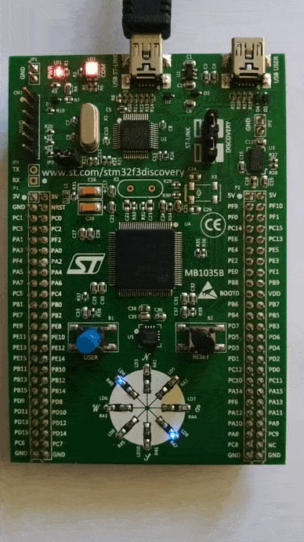
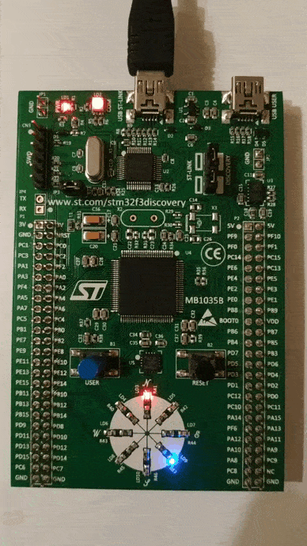
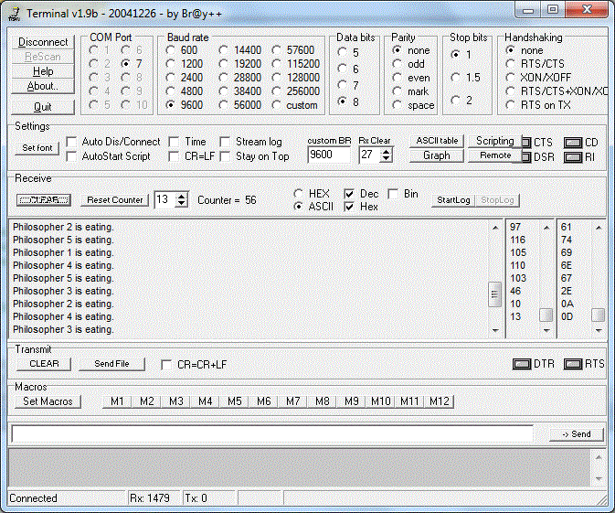

**Description**

*Home tasks are:*

• Create program with livelock. 
• Create program with using queue. 
• Create program "The Dining Philosophers". 

**Requirements**

Keil uVision v5.35.0.0 
STM32CubeMX v6.3.0 

**Task 1 notes**

The program is an artificial example of livelock. Two tasks (processes) are being considered.
Each task uses a common resource (the LEDs of green colors). A mutex is used to synchronize these tasks.
The first task takes the resource (mutex) and checks if the second task is blocked. If it is so, 
the first task gives the resource (mutex) and waits for it. The second task takes the mutex and checks
if the first task is in blocked states. If it is, the second task gives the resource and  waits for it.
And this series of actions repeats indefinitely - the tasks change its states with no progress.
The useful work performed by tasks is in toggling LEDs of green color. When the task gives the mutex
and frees the common resource, the LED of blue color toggles its state. So, when the livelock occurs,
the LEDs of blue color are toggling continuously.
 

**Task 1 demonstration**
 

**Task 2 notes**

There are two tasks in the program. The first task generates two random numbers. The first number is used
to choose LED which state will be toggled. The second random number is used to make a delay before next
chande of the LEDs state. Another task toggles the LED state depending on the recevied pin number and makes time delay.
A queue is used to pass the data betwen these tasks. If the queue is full, the first task waits until there will be 
available space on the queue. The second task reads data from the queue unless queue is empty. 
 

**Task 2 demonstration**
 

**Task 3 notes**

The program simulates the dining philosophers. The philosopher (task) eats incredibly delicious italian food
for some time (does some useful work) only if both forks on his sides are available (binary semaphores in this case). 
When the philosopher finishes eating, he puts the forks on the table (releases the semaphores) and 
thinks for a while. Blinking LEDs, each of which impersonates the philosophers, indicates,
that the philosophers are eating. The serial number of the philosopher that is eating at the moment is sent via USART2.
The next solution was used to avoid deadlock: a philosopher is allowed to pick their forks only if both forks
are available at the same time.
 

**Task 3 demonstration**
 

 
